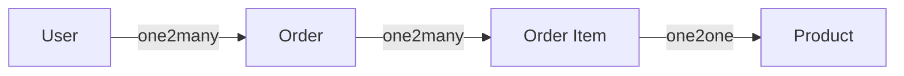
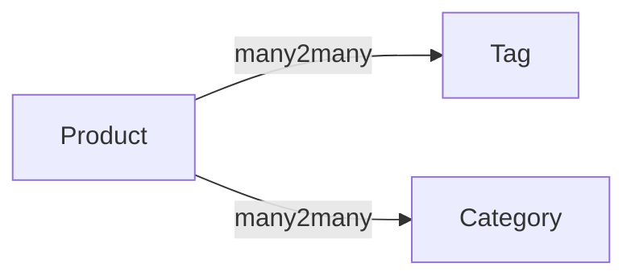
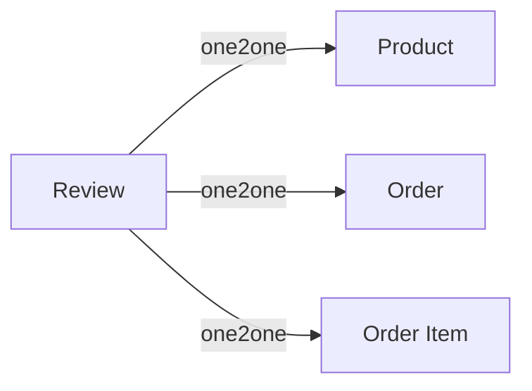

# Element
 * User
   * id
   * name
   * email
   * password
   * timestamp
 * Product
 	* id
 	* name
 	* price
 	* timestamp
 * Order
 	* id
 	* user_id
 	* amount
 	* timestamp
 * Order Item
 	* id
 	* order_id
 	* product_id
 	* name
 	* qty
 	* price
 	* subtotal
 	* timestamp
 * Category
 	* id
 	* name
 	* timestamp
 * Tag
 	* id
 	* name
 	* timestamp
 * Review
 	* id
 	* user_id
 	* type
 	* entity_id
 	* content

