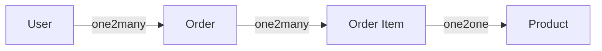
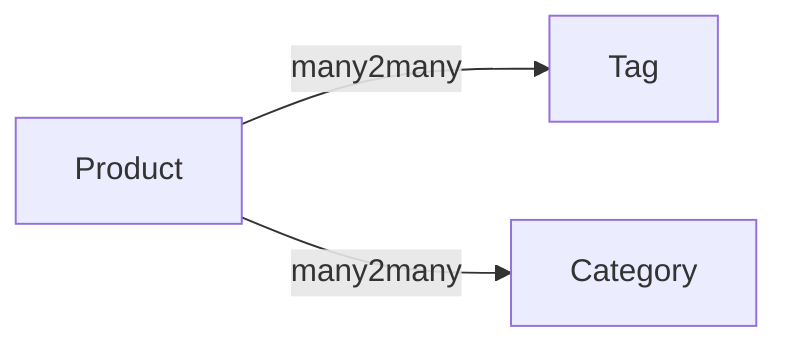
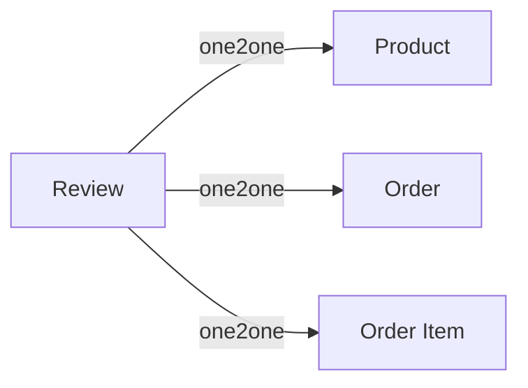

# Element

 * User
   * id
   * name
   * email
   * password
   * timestamp
 * Product
   * id
   * name
   * price
   * timestamp
 * Order
   * id
   * user_id
   * amount
   * timestamp
 * Order Item
   * id
   * order_id
   * product_id
   * name
   * qty
   * price
   * subtotal
   * timestamp
 * Category
   * id
   * name
   * timestamp
 * Tag
   * id
   * name
   * timestamp
 * Review
   * id
   * user_id
   * type
   * entity_id
   * content

# Diagram








# Migration

## Users
```
Schema::create('users', function (Blueprint $table) {
    $table->increments('id');
    $table->string('name');
    $table->string('email');
    $table->string('password');
    $table->timestamps();
});
```


## Products
```
Schema::create('products', function (Blueprint $table) {
    $table->increments('id');
    $table->string('name');
    $table->string('image');
    $table->decimal('price', 10, 2);
    $table->timestamps();
});
```

## Orders
```
Schema::create('orders', function (Blueprint $table) {
    $table->increments('id');
    $table->integer('user_id')->unsigned(true);
    $table->foreign('user_id')->references('id')->on('users');

    $table->decimal('amount', 12, 2);
    $table->timestamps();
});
```

## Order Items
```
Schema::create('items', function (Blueprint $table) {
    $table->increments('id');
    $table->integer('order_id')->nullable(false)->unsigned(true);
    $table->foreign('order_id')->references('id')->on('orders');

    $table->integer('product_id')->nullable(false)->unsigned(true);
    $table->foreign('product_id')->references('id')->on('products');

    $table->string('name');
    $table->decimal('price', 10, 2);
    $table->integer('qty');
    $table->decimal('subtotal', 12, 2);
    $table->timestamps();
});
```

## Categories
```
Schema::create('categories', function (Blueprint $table) {
    $table->increments('id');
    $table->string('name');
    $table->timestamps();
});
```

### Link Category to Product
```
Schema::create('category_product', function (Blueprint $table) {
    $table->increments('id');
    $table->integer('product_id')->unsigned(true)->nullable();
    $table->integer('category_id')->unsigned(true)->nullable();
    $table->foreign('product_id')->references('id')->on('products');
    $table->foreign('category_id')->references('id')->on('categories');
});
```

## Tags
```
Schema::create('tags', function (Blueprint $table) {
    $table->increments('id');
    $table->string('name');
    $table->timestamps();
});
```

### Link tag to Product
```
Schema::create('product_tag', function (Blueprint $table) {
    $table->increments('id');
    $table->integer('product_id')->unsigned(true)->nullable();
    $table->integer('tag_id')->unsigned(true)->nullable();
    $table->foreign('product_id')->references('id')->on('products');
    $table->foreign('tag_id')->references('id')->on('tags');
});
```

## Reviews
```
Schema::create('reviews', function (Blueprint $table) {
	$table->increments('id');
	$table->integer('user_id')->unsigned(true);
    $table->foreign('user_id')->references('id')->on('users');

    $table->integer('reviewable_id')->unsigned(true)->nullable(false);
	$table->string('reviewable_type')->nullable(false);

	$table->text('content')->nullable(false);
	$table->timestamps();
});
```