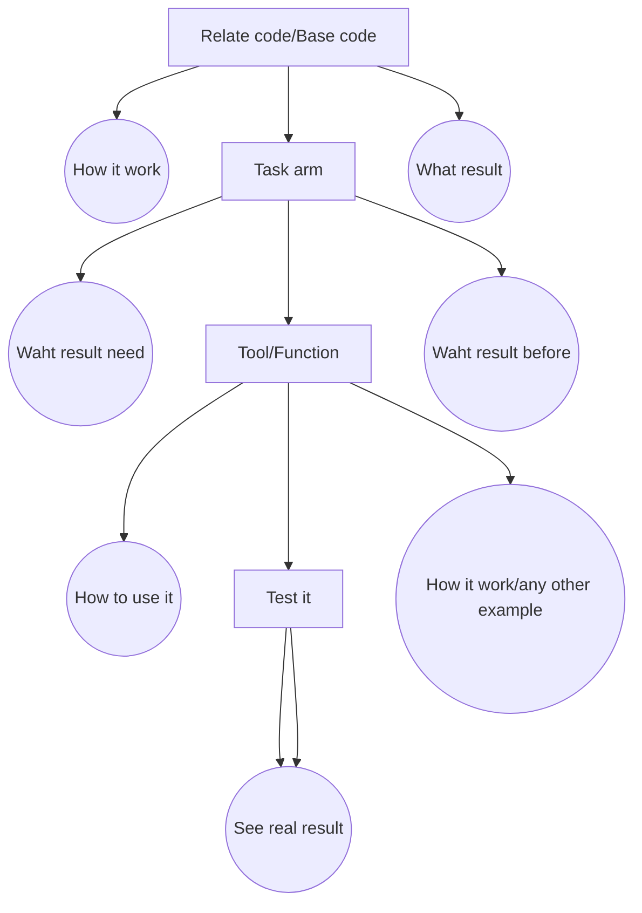

```mermaid
graph TB

A[Relate code/Base code] --> B((How it work))
A[Relate code/Base code] --> D[Task arm]
A[Relate code/Base code] --> C((What result))
D[Task arm] --> E((Waht result need))
D[Task arm] --> F[Tool/Function]
D[Task arm] --> L((Waht result before))
F[Tool/Function] --> G((How to use it))
F[Tool/Function] --> J[Test it]
F[Tool/Function] --> H((How it work/any other example))
J[Test it] --> K((Test case))
J[Test it] --> K((See real result))
```