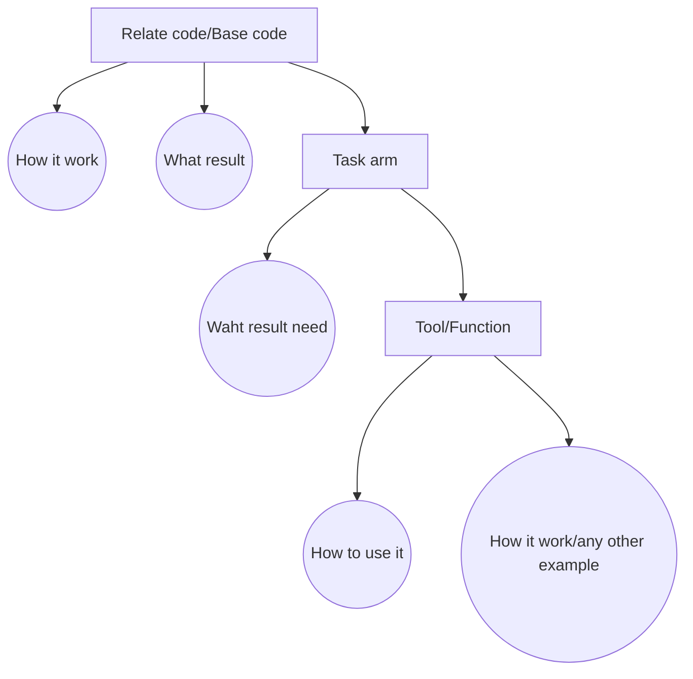

```mermaid
graph TB

A[Relate code/Base code] --> B((How it work))
A[Relate code/Base code] --> C((What result))
A[Relate code/Base code] --> D[Task arm]
D[Task arm] --> E((Waht result need))
D[Task arm] --> F[Tool/Function]
F[Tool/Function] --> G((How to use it))
F[Tool/Function] --> H((How it work/any other example))
```