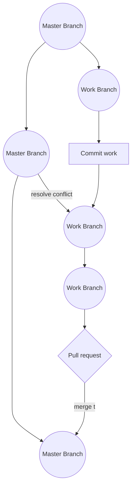

# Branch
## Branch type
 - Feature
 - Hot Fixes
 - Master
 - Release
 - Staging


# Commit
```
Short (50 chars or less) summary of changes

More detailed explanatory text, if necessary.  Wrap it to about 72
characters or so.  In some contexts, the first line is treated as the
subject of an email and the rest of the text as the body.  The blank
line separating the summary from the body is critical (unless you omit
the body entirely); tools like rebase can get confused if you run the
two together.

Further paragraphs come after blank lines.

  - Bullet points are okay, too

  - Typically a hyphen or asterisk is used for the bullet, preceded by a
    single space, with blank lines in between, but conventions vary here

```

## Hot Fixes branch



## Feature branch
```mermaid
graph TB

```


Ref 
https://git-scm.com/book/en/v2/Distributed-Git-Contributing-to-a-Project
