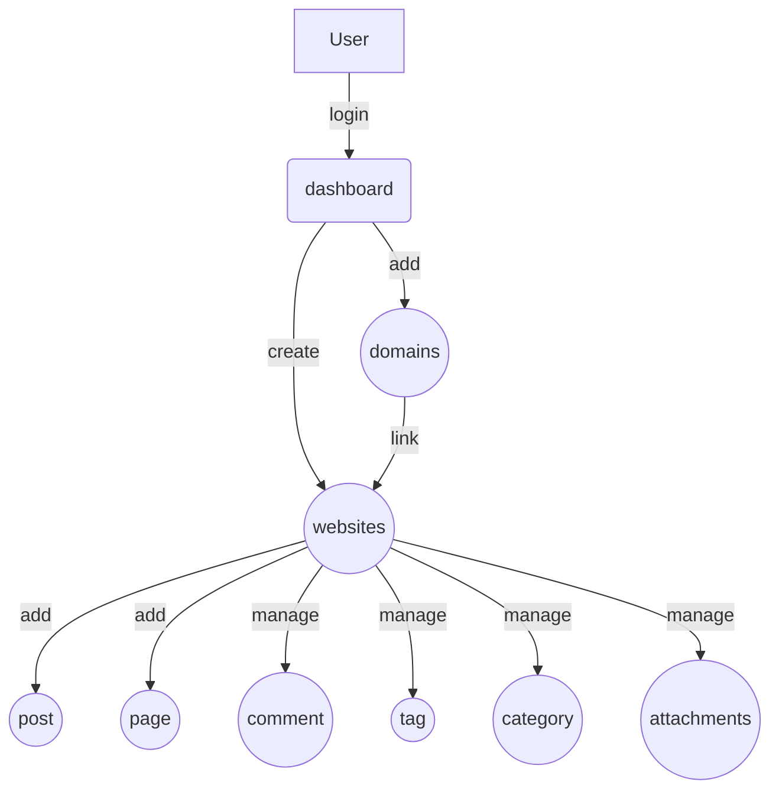

## Requirement
* Front-end
* Back-end
   * user can login
   * user can create website
   * user can link domain(s) to webiste. 
   * user can see posts of website

### Backend

## Highlight
* `view()` generate html and store to memcache

# Decition
Not possible unless php fully supply markdown
- [ ]check if possiable let front end js to handle markdown coverting.

