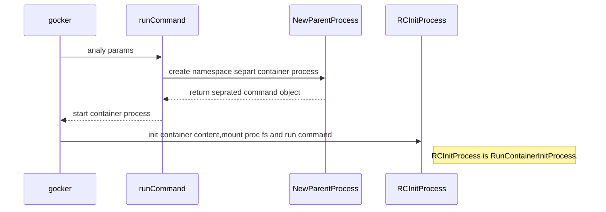
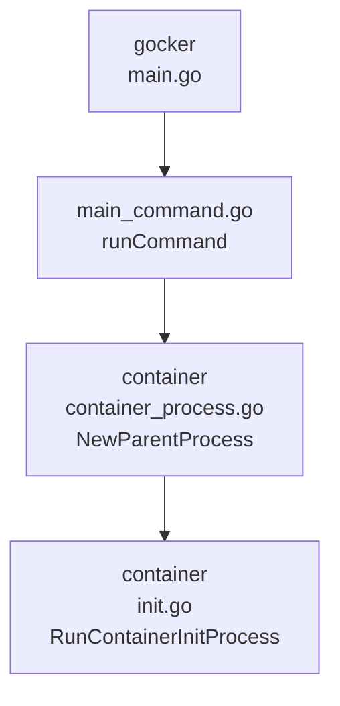

```mermaid
sequenceDiagram

gocker ->> runCommand: analy params
runCommand ->> NewParentProcess: create namespace separt container process
NewParentProcess -->> runCommand: return seprated command object
runCommand -->> gocker:start container process

gocker ->> RCInitProcess: init container content,mount proc fs and run command
Note right of RCInitProcess: RCInitProcess is RunContainerInitProcess. 
```

```mermaid
graph TB
gocker[gocker<br />main.go] --> runCommand[main_command.go<br />runCommand]
runCommand[main_command.go<br />runCommand] --> NewParentProcess[container<br />container_process.go<br />NewParentProcess]
NewParentProcess[container<br />container_process.go<br />NewParentProcess] --> RunContainerInitProcess[container<br />init.go<br />RunContainerInitProcess]

```