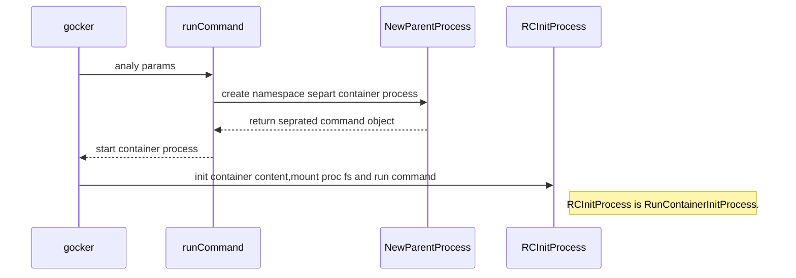
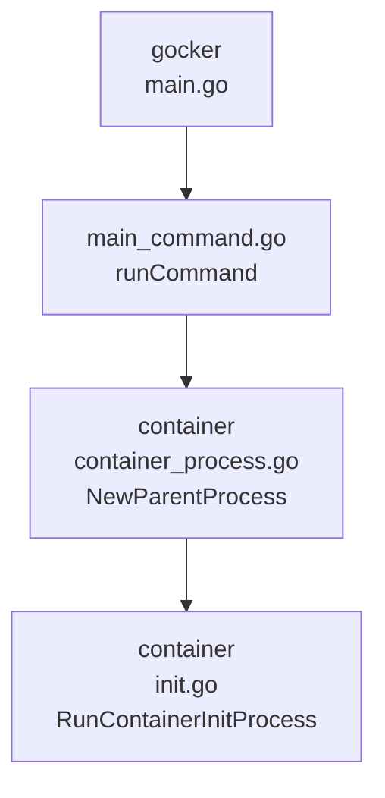

## Env
```
export GOROOT=/usr/local/go
export GOPATH=$HOME/go
export PATH=$PATH:$GOROOT/bin:$GOPATH/bin
```

## Build
```
94  export GOROOT=/usr/local/go
95  export GOPATH=$HOME/go
96  export PATH=$PATH:$GOROOT/bin:$GOPATH/bin
97  go get github.com/sirupsen/logrus
98  ls
99  go build .
100  go build -a
101  go build -a .
102  go get github.com/sirupsen/logrus
103  go build -a .
104  go get github.com/urfave/cli
105  go build -a .
106  go get github.com/xianlubird
107  go get github.com/xianlubird/mydocker
108  ls
109  go get github.com/inputx/gocker
110  history
```

### Build with glide
```
curl https://glide.sh/get | sh
glide install
```


Ref
* [GOPATH](https://til.codes/how-do-i-set-the-gopath-environment-variable-on-ubuntu/)