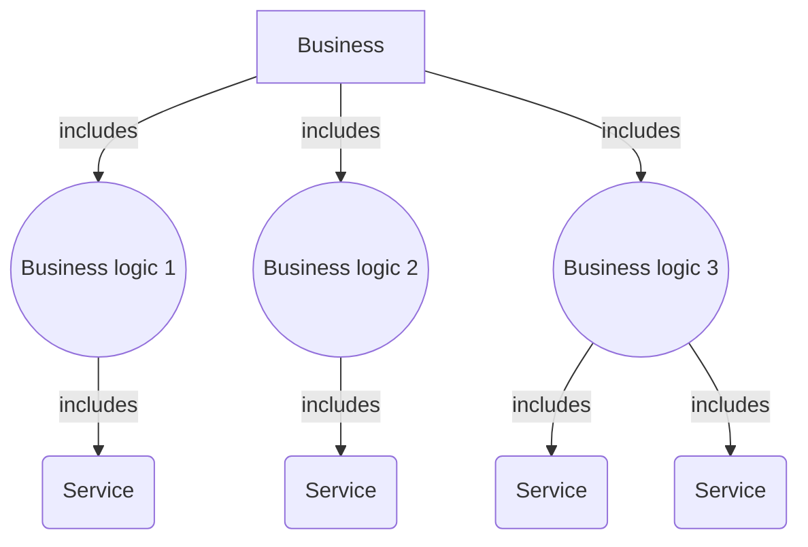

```mermaid
graph TB


B[Business] -- includes --> BL1((Business logic 1))
B[Business] -- includes --> BL2((Business logic 2))
B[Business] -- includes --> BL3((Business logic 3)) 


BL1((Business logic 1)) -- includes --> S1(Service)
BL2((Business logic 2)) -- includes --> S2(Service)
BL3((Business logic 3)) -- includes --> S3(Service)
BL3((Business logic 3)) -- includes --> S4(Service)

```