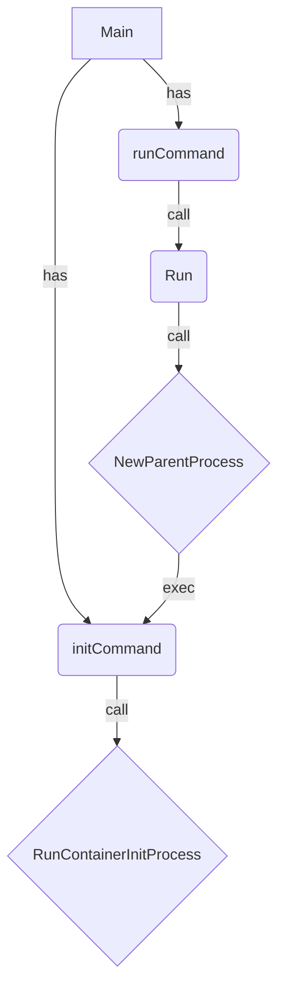

# Main
Setup CLI command instance by using `github.com/urfave/cli`. 

# Main_command
Add two sub-commands into CLI command.
* runCommand: `gocker run`, create container with namespace and cgroups limitation
* initCommand: `gocker init`, internal use only. 

# Run
`runCommand` will call this function.

