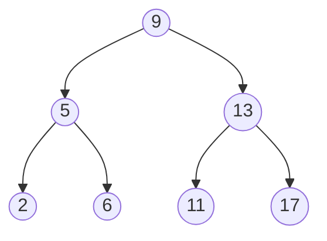

## Binary tree




## Code
```c
#include<stdio.h>
#include<malloc.h>


struct Binary_tree{
    int data;
    struct Binary_tree *left;
    struct Binary_tree *right;
};

typedef struct Binary_tree node;


void add_node(node **tree,int value){
    node *temp=NULL;
    if(!(*tree)){
        temp=(node *)malloc(sizeof(node));
        temp->left=temp->right=NULL;
        temp->data=value;
        *tree=temp;
        return;
    }
    if(value<(*tree)->data){
        add_node(&(*tree)->left,value);
    }else if(value>(*tree)->data){
        add_node(&(*tree)->right,value);
    }
}

// pre order traverse

void fir_read(node *tree){
    if(tree){
        printf("%d\n",tree->data);
        fir_read(tree->left);
        fir_read(tree->right);
    }
}

// in order traverse

void mid_read(node *tree){
    if(tree){
        mid_read(tree->left);
        printf("%d\n",tree->data);
        mid_read(tree->right);
    }
}

// post order traverse

void las_read(node *tree){
    if(tree){
        las_read(tree->left);
        las_read(tree->right);
        printf("%d\n",tree->data);
    }
}

// test

int main(){
    node *tree;
    node *temp;
    tree=NULL;

    add_node(&tree,9);
    add_node(&tree,5);
    add_node(&tree,13);
    add_node(&tree,2);
    add_node(&tree,6);
    add_node(&tree,11);
    add_node(&tree,17);

    printf("pre order traverse \n");
    fir_read(tree);

    printf("in order traverse \n"); 
    mid_read(tree);

    printf("post order traverse \n"); 
    las_read(tree);


    return 0;
} 
```


A python example [^1].

[^1]: [code](https://codereview.stackexchange.com/questions/150606/binary-tree-in-python-exercise)

```python
from __future__ import print_function
import math
import os

class BinaryTree:
    __left = None
    __right = None
    __value = None

    def __init__(self):
        return

    def addNode(self, value):
        if self.__value is None:
            self.__value = value

        elif value > self.__value:
            if self.__right is None:
                self.__right = BinaryTree()
            self.__right.addNode(value)

        elif value < self.__value:
            if self.__left is None:
                self.__left = BinaryTree()
            self.__left.addNode(value)

        return

    def preOrderTraverse(self):
        """
        Performs a pre-order traversal of the tree.
        Returns the list of elements
        """
        elements = []
        if self.__value is not None:
            # Visit the root node first
            elements.append(self.__value)
            # Then visit the left node if present
            if self.__left is not None:
                elements += self.__left.preOrderTraverse()
            # Then visit the right node if present
            if self.__right is not None:
                elements += self.__right.preOrderTraverse()

        return elements

    def inOrderTraverse(self):
        """
        Performs a in-order traversal of the tree.
        Returns the list of elements
        """
        elements = []
        if self.__value is not None:
            # Visit the left node first if present
            if self.__left is not None:
                elements += self.__left.inOrderTraverse()
            # Then visit the root node
            elements.append(self.__value)
            # Then visit the right node if present
            if self.__right is not None:
                elements += self.__right.inOrderTraverse()

        return elements


    def postOrderTraverse(self):
        """
        Performs a post-order traversal of the tree.
        Returns the list of elements
        """
        elements = []
        if self.__value is not None:
            # Visit the left node first if present
            if self.__left is not None:
                elements += self.__left.postOrderTraverse()
            # Then visit the right node if present
            if self.__right is not None:
                elements += self.__right.postOrderTraverse()
            # Then visit the root node
            elements.append(self.__value)

        return elements


if __name__ == "__main__":
    binarytree = BinaryTree()
    binarytree.addNode(23)
    binarytree.addNode(15)
    binarytree.addNode(19)
    binarytree.addNode(8)
    binarytree.addNode(7)
    binarytree.addNode(42)
    binarytree.addNode(0)
    binarytree.addNode(1)
    elements = binarytree.preOrderTraverse()

    print("Pre order traversal: ", end="")
    for val in elements:
        print(val, end=" ")

    print("")

    elements = binarytree.inOrderTraverse()

    print("In order traversal: ", end="")
    for val in elements:
        print(val, end=" ")

    print("")

    elements = binarytree.postOrderTraverse()

    print("Post order traversal: ", end="")
    for val in elements:
        print(val, end=" ")

    print("")
```


---