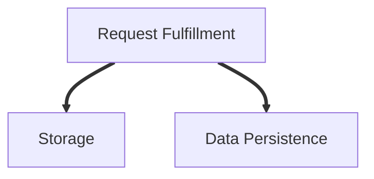
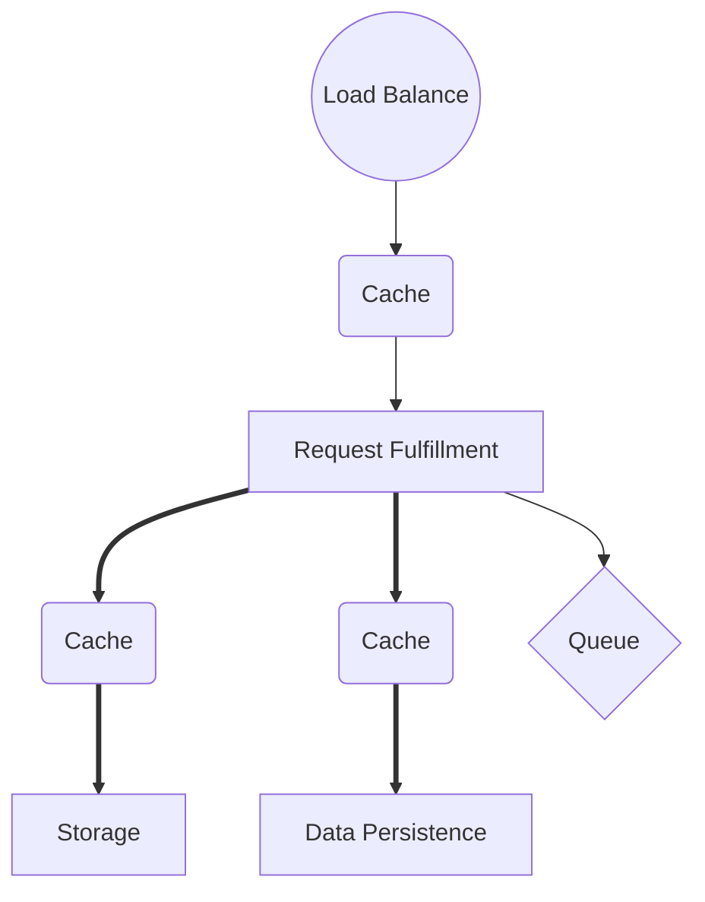

## Core

### Request Fulfillment
 
Could be 
 - Application engine
 - VM
 - Serverless
 - Server
 - Service

### Storage

Store file or object. 

### Data Persistence
 - Relation DB
 - Document DB

---

## Traffic

### Load balance

See [load balance](/2019/12/11/load-balance.html)

### Cache
 - redis
 - memcache

### Queue
 - redis
 - kafka

