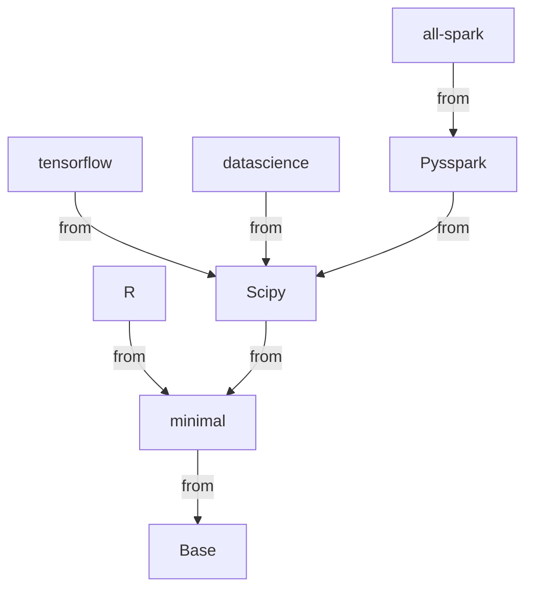

Repo: https://github.com/jupyter/docker-stacks

## Relationship

```mermaid
graph TB

R[R] -- from --> M[minimal]
T[tensorflow] -- from --> SC[Scipy]
A[all-spark]  -- from --> PY[Pysspark]
D[datascience] -- from --> SC[Scipy]
PY[Pysspark] -- from --> SC[Scipy]
M[minimal] -- from --> B[Base]
SC[Scipy] -- from --> M[minimal]

```

