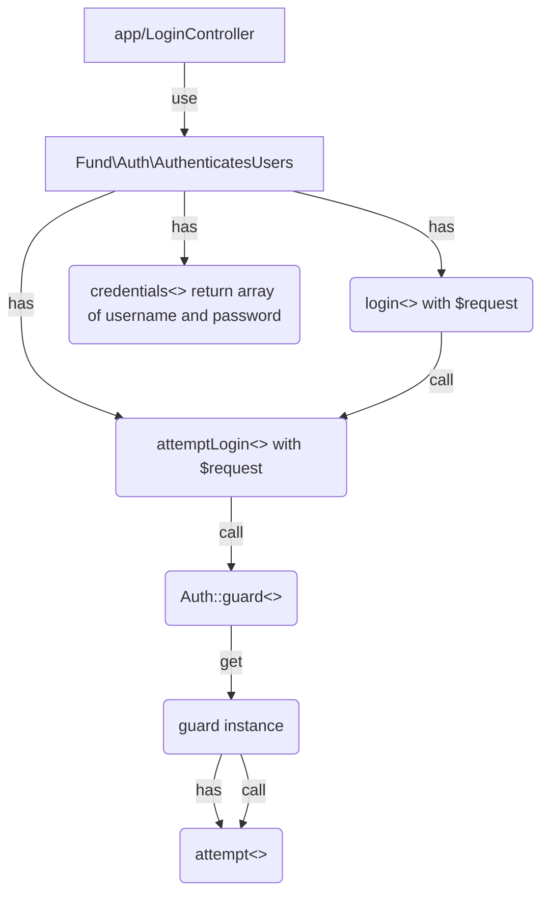

* [Laravel Multiple Guards Authentication: Setup and Login](https://medium.com/@sagarmaheshwary31/laravel-multiple-guards-authentication-setup-and-login-2761564da986)
* [How to Create a Custom Authentication Guard in Laravel](https://code.tutsplus.com/tutorials/how-to-create-a-custom-authentication-guard-in-laravel--cms-29667)

