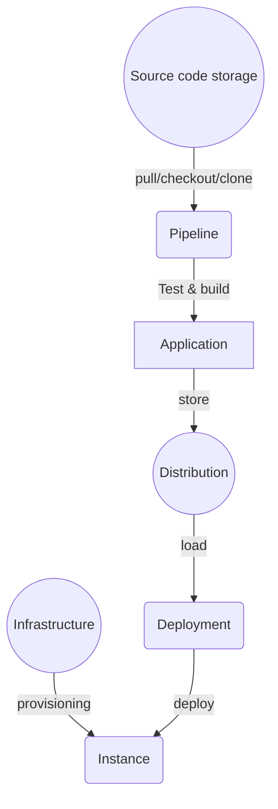

### Source code storage providers
* github
* gitlab
* bitbucket

### Pipeline Providers
* github action
* gitlab runner
* bitbucket pipeline
* Jenkins
* circleci
* AWS codebuild

### Distribution Storage providers

As container image
* github package
* docker hub
* gitlab registry
* AWS registry

As Package
* maven

### Infrastructure provider
* AWS
* google cloud
* Azure

### Provisioning tools
* CloudFormation
* Terraform
* Ansible

### Deployment tools
* kubernetes
* docker swarm
* fargate
* mesos
