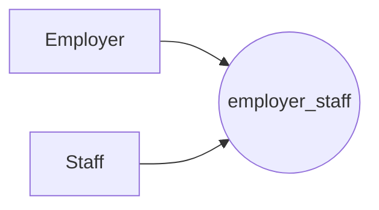

# Table

## Check table

```php
if (!Schema::hasTable('ams_retail_partners')) {
	// Opt tables
}
```

## Create table
```php
Schema::create('provider_settings', function (Blueprint $table) {
    $table->increments('id');

    $table->integer('provider_id')->unsigned();
    $table->foreign('provider_id')->references('id')->on('providers')->onDelete('cascade');

    $table->string('key');
    $table->text('value')->nullable(true);
    $table->timestamps();
});
```

### Create table with foreign key

```php
Schema::create('link_product_retailer', function (Blueprint $table) {
    $table->increments('id');
    $table->integer('product_id')->unsigned()->nullable();
    $table->integer('retailer_id')->unsigned()->nullable();
    $table->foreign('product_id')->references('id')->on('products');
    $table->foreign('retailer_id')->references('id')->on('retailers');
});
```

## Foreign Key

### Drop Foreign Key
```php
Schema::table('table', function(Blueprint $table){
    $table->dropForeign('foreign_name');
});
```

## Index
### Add index
```php
Schema::table('table', function(Blueprint $table) {
    $table->index(['col1', 'col2']);
});
```

### Remove index
```php
Schema::table('table', function(Blueprint $table) {
    $table->dropIndex('index_name');
});
```

## Rename table
```php
Schema::rename('talbe_name', 'new_talbe_name');
```

## Drop table
```php
Schema::dropIfExists('table_name');
 // DROP TABLE IF EXISTS `search_estore_tags_index`;
```

# View

## Create view
```php
DB::statement("
        CREATE 
            OR REPLACE 
            SQL SECURITY INVOKER
        VIEW `search_index_giftcards` AS

        SELECT * 
        FROM `table`
        ")

```
## Drop view
```php
DB::statement('DROP VIEW IF EXISTS `product_retailer`;');
```

# Table row
```php
\App\Models\Model::where( [
    'key' => 'value'
])->first()->update([
    'key' => 'value'
    ],
]);
```


# Model

## Relationship


```php
$master->hasMany(Slave::class);
$slave->belongsTo(Master::class);
```



```php
$employer->belongsToMany(Staff::class)
$staff->belongsToManu(Employer::class)
```


